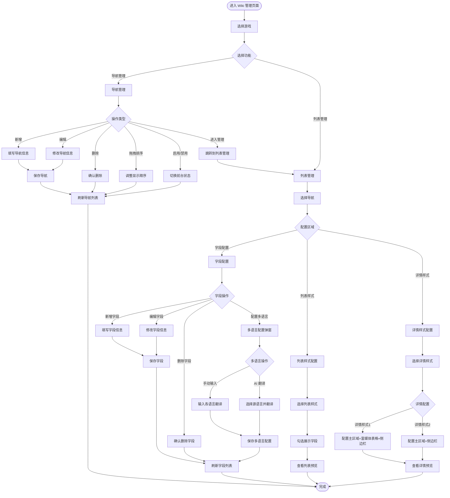

# Wiki 管理 PRD

# 背景

> 提示：请说明需求来源和需求产生的场景，清晰描述需求背景。

[用户填写]

# 目标

> 提示：请定义可量化的目标，能够直接明确地根据目标验证需求完成情况。目标应具体、可衡量、可验证。

[用户填写]

# 需求

## 原型

[用户填写原型地址]

## 用户使用流程

## 页面顶部

1. 面包屑导航：显示当前位置
   - 文案：「Wiki 管理」

2. 游戏筛选器：选择要管理的游戏
   - 交互：
     - 下拉选择游戏
     - 选择后刷新页面数据
   - 规则：
     - 默认选中第一个游戏
     - 切换游戏后保留当前 Tab 状态

## 主 Tab 切换

1. Tab 标签页：切换导航管理和列表管理
   - 交互：
     - 点击 Tab 切换视图
     - 支持 URL 参数控制（`?tab=list&nav=items`）
   - 状态：
     - 导航管理（默认）
     - 列表管理
   - 文案：
     - Tab 1：「导航管理」
     - Tab 2：「列表管理」

## 导航管理

### 页面说明

1. 说明文字：解释导航管理的作用
   - 文案：「管理前台 Wiki 的导航项，每个导航对应一个独立的 Wiki 页面（如道具、怪物、卡片等）」

2. 新增导航按钮：打开新增导航弹窗
   - 交互：点击打开弹窗
   - 文案：「新增导航」

### 统计卡片

1. 总导航数卡片：显示导航总数
   - 规则：实时统计所有导航数量
   - 文案：「总导航数」

2. 已启用卡片：显示已启用的导航数量
   - 规则：统计 `enabled: true` 的导航
   - 文案：「已启用」

3. 未启用卡片：显示未启用的导航数量
   - 规则：统计 `enabled: false` 的导航
   - 文案：「未启用」

### 操作提示

1. 提示信息：说明拖拽排序和管理功能
   - 文案：「💡 拖拽左侧 [图标] 图标可调整导航在前台的显示顺序。点击「管理」进入该导航的字段与数据管理。」

### 导航列表表格

1. 拖拽图标列：用于拖拽排序
   - 交互：
     - 按住图标拖拽行
     - 拖拽到目标位置释放
     - 自动更新 order 字段
   - 规则：
     - 所有行都可拖拽
     - 拖拽后立即生效

2. 导航名称列：显示导航名称和 Key
   - 交互：无
   - 文案：
     - 主文本：导航名称（如「道具」）
     - 副文本：`key: [导航Key]`（如「key: items」）

3. 说明列：显示导航说明
   - 交互：无
   - 文案：导航的描述文字

4. 字段数列：显示该导航配置的字段数量
   - 交互：无
   - 文案：「[数量] 个」
   - 规则：实时统计该导航下的字段数量

5. 前台启用列：控制导航是否在前台显示
   - 交互：
     - 点击开关切换状态
     - 立即生效
   - 状态：
     - 开启：前台显示该导航
     - 关闭：前台隐藏该导航

6. 操作列：提供管理、编辑、删除操作
   - 管理按钮：
     - 交互：点击进入该导航的列表管理
     - 规则：
       - 除 NPC 和地图外，切换到列表管理 Tab 并选中该导航
       - NPC 和地图跳转到独立管理页面（预留功能，本期不实现）
     - 文案：「管理」
   - 编辑按钮：
     - 交互：点击打开编辑弹窗
     - 文案：「编辑」
   - 删除按钮：
     - 交互：
       - 点击显示确认弹窗
       - 确认后删除导航
     - 文案：「删除」
     - 边界：删除后无法恢复

### 新增/编辑导航弹窗

1. 弹窗标题：根据操作类型显示
   - 文案：
     - 新增：「新增导航」
     - 编辑：「编辑导航」

2. 导航 Key 输入框：输入导航的英文标识
   - 交互：
     - 新增时可输入
     - 编辑时禁用（不可修改）
   - 规则：
     - 必填
     - 只能包含字母、数字、下划线和连字符
     - 不能与现有导航 Key 重复
   - 文案：
     - 标签：「导航 Key（英文标识）」
     - 占位符：「如：cards、pets」
     - 错误提示：「请输入导航 Key」「只能包含字母、数字、下划线和连字符」「导航 Key 已存在」

3. 导航名称输入框：输入导航的中文名称
   - 交互：输入文本
   - 规则：必填
   - 文案：
     - 标签：「导航名称」
     - 占位符：「如：卡片、宠物」
     - 错误提示：「请输入导航名称」

4. 导航说明输入框：输入导航的描述
   - 交互：输入多行文本
   - 规则：选填
   - 文案：
     - 标签：「导航说明」
     - 占位符：「简要描述该导航包含的内容」

5. 前台启用开关：控制导航是否在前台显示
   - 交互：点击切换
   - 规则：默认开启
   - 文案：「前台启用」

6. 保存按钮：保存导航配置
   - 交互：
     - 点击验证表单
     - 验证通过后保存并关闭弹窗
     - 显示成功提示
   - 文案：
     - 按钮：「保存」
     - 成功提示：「导航已新增」「导航已更新」

7. 取消按钮：关闭弹窗
   - 交互：点击关闭弹窗，不保存
   - 文案：「取消」

## 列表管理

### 导航选择器

1. 当前导航下拉框：选择要配置的导航
   - 交互：
     - 下拉选择导航
     - 选择后切换到该导航的配置
     - 切换时清空列表样式的字段选择
   - 规则：
     - 显示所有导航（包括未启用的）
     - 未启用的导航显示「未启用」标签
   - 文案：
     - 标签：「当前导航：」
     - 选项：导航名称

2. 新增字段按钮：打开新增字段弹窗
   - 交互：点击打开弹窗
   - 文案：「新增字段」

### 字段配置

1. 模块标题：说明字段配置的作用
   - 文案：
     - 标题：「字段配置」
     - 说明：「配置前台页面展示的字段及其属性。点击名称旁的 [Languages 图标] 图标可配置多语言，支持 AI 一键翻译。」

2. 字段列表表格：显示所有字段
   - 字段 Key 列：
     - 交互：无
     - 文案：字段 Key（代码样式显示）
   - 显示名称列：
     - 交互：
       - 点击 Languages 图标打开多语言配置弹窗
     - 文案：
       - 主文本：字段的中文名称
       - 语言标签：已配置的语言简称（zh、en、ko 等）
     - 规则：
       - 鼠标悬停语言标签显示完整翻译
   - 类型列：
     - 交互：无
     - 文案：字段类型标签（text、number、image、tag、rich-table）
   - 操作列：
     - 编辑按钮：
       - 交互：点击打开编辑弹窗
       - 文案：「编辑」
     - 删除按钮：
       - 交互：
         - 点击显示确认弹窗
         - 确认后删除字段
       - 文案：「删除」
       - 边界：删除后无法恢复，同时从列表样式和详情样式配置中移除

3. 空状态：当前导航无字段时显示
   - 文案：「该导航暂无字段配置，点击「新增字段」开始添加」

### 新增/编辑字段弹窗

1. 弹窗标题：根据操作类型显示
   - 文案：
     - 新增：「新增字段」
     - 编辑：「编辑字段」

2. 字段 Key 输入框：输入字段的英文标识
   - 交互：
     - 新增时可输入
     - 编辑时禁用（不可修改）
   - 规则：
     - 必填
     - 只能包含字母、数字和下划线
     - 不能与当前导航的现有字段 Key 重复
   - 文案：
     - 标签：「字段 Key」
     - 占位符：「如：attack_speed」
     - 错误提示：「请输入字段 Key」「只能包含字母、数字和下划线」「字段 Key 已存在」

3. 显示名称输入框：输入字段的中文名称
   - 交互：输入文本
   - 规则：必填
   - 文案：
     - 标签：「显示名称（中文）」
     - 占位符：「如：攻击速度」
     - 错误提示：「请输入显示名称」

4. 字段类型下拉框：选择字段类型
   - 交互：下拉选择
   - 规则：必填
   - 文案：
     - 标签：「字段类型」
     - 选项：
       - 「text — 文本」
       - 「number — 数字」
       - 「image — 图片/图标」
       - 「tag — 标签」
       - 「rich-table — 富媒体表」

5. 前台显示开关：控制字段是否在前台显示
   - 交互：点击切换
   - 规则：默认开启
   - 文案：「前台显示」

6. 列表展示开关：控制字段是否在列表页显示
   - 交互：点击切换
   - 规则：默认开启
   - 文案：「列表展示」

7. 可排序开关：控制字段是否支持排序
   - 交互：点击切换
   - 规则：默认关闭
   - 文案：「可排序」

8. 可筛选开关：控制字段是否支持筛选
   - 交互：点击切换
   - 规则：默认关闭
   - 文案：「可筛选」

9. 必填开关：控制字段是否必填
   - 交互：点击切换
   - 规则：
     - 默认关闭
     - 编辑时如果已设置为必填则禁用（不可取消必填）
   - 文案：「必填」

10. 保存按钮：保存字段配置
    - 交互：
      - 点击验证表单
      - 验证通过后保存并关闭弹窗
      - 显示成功提示
    - 文案：
      - 按钮：「保存」
      - 成功提示：「字段已新增」「字段已更新」

11. 取消按钮：关闭弹窗
    - 交互：点击关闭弹窗，不保存
    - 文案：「取消」

### 多语言配置弹窗

1. 弹窗标题：显示字段名称
   - 文案：「配置多语言 - [字段名称]」

2. 源语言选择器：选择翻译源语言
   - 交互：下拉选择语言
   - 规则：默认选中中文（zh）
   - 文案：
     - 标签：「源语言」
     - 选项：语言简称（zh、en、ko、ja、th、vi、id、pt、es、ru、de、fr、it）

3. AI 翻译按钮：一键翻译所有语言
   - 交互：
     - 点击触发 AI 翻译
     - 翻译完成后自动填充各语言输入框
   - 状态：
     - 默认：可点击
     - 翻译中：显示加载状态
     - 翻译完成：恢复默认状态
   - 文案：「AI 一键翻译」
   - 边界：
     - 翻译失败显示错误提示
     - 翻译结果可手动修改

4. 语言输入框列表：为每种语言提供输入框
   - 交互：输入文本
   - 规则：
     - 显示所有支持的语言
     - 中文（zh）为必填
     - 其他语言选填
   - 文案：
     - 标签：语言简称 + 语言名称（如「zh 中文」「en English」）
     - 占位符：「请输入 [语言名称] 翻译」

5. 保存按钮：保存多语言配置
   - 交互：
      - 点击验证表单
      - 验证通过后保存并关闭弹窗
      - 显示成功提示
      - 更新字段列表中的语言标签
   - 文案：
     - 按钮：「保存」
     - 成功提示：「多语言配置已保存」

6. 取消按钮：关闭弹窗
   - 交互：点击关闭弹窗，不保存
   - 文案：「取消」

### 列表样式

1. 模块标题：说明列表样式的作用
   - 文案：
     - 标题：「列表样式」
     - 说明：「选择前台列表页的展示样式，不同样式支持的字段数量和类型不同。」

2. 样式选择卡片：4 种样式横向排列
   - 横向卡片列表：
     - 交互：点击选中该样式
     - 状态：
       - 未选中：灰色边框
       - 已选中：蓝色边框 + 蓝色背景 + 「已选」标签
     - 文案：
       - 标题：「横向卡片列表」
       - 说明：「图片必选 + 1~4 个文本/数字字段，适合道具、怪物等」
       - 规则：「图片必选 + 最多 4 个文本/数字」
     - 规则：
       - 最多选择 5 个字段（1 个图片 + 4 个文本/数字）
       - 必须包含 1 个图片字段
       - 支持字段类型：image、text、number
       - **【用户填写】请补充：图片字段的具体限制规则（如：是否只能选第一个可见的图片字段？）**
       - **【用户填写】请补充：文本/数字字段的选择顺序规则（如：是否按字段配置顺序？）**
   - 大图卡片宫格：
     - 交互：点击选中该样式
     - 状态：同上
     - 文案：
       - 标题：「大图卡片宫格」
       - 说明：「图片必选 + 最多 1 个文本/数字字段，适合卡片、宠物等」
       - 规则：「图片必选 + 最多 1 个文本/数字」
     - 规则：
       - 最多选择 2 个字段（1 个图片 + 1 个文本/数字）
       - 必须包含 1 个图片字段
       - 支持字段类型：image、text、number
       - **【用户填写】请补充：图片字段的具体限制规则**
   - 富媒体表格：
     - 交互：点击选中该样式
     - 状态：同上
     - 文案：
       - 标题：「富媒体表格」
       - 说明：「图文混排表格，单元格支持多行内容，适合配方、套装等复杂数据」
       - 规则：「最多 8 个字段」
     - 规则：
       - 最多选择 8 个字段
       - 支持字段类型：text、number、image、tag、rich-table
       - 不要求必须包含图片字段
       - **【用户填写】请补充：rich-table 类型字段的展示规则（如：单元格内如何显示多行内容？）**
   - 图片卡片：
     - 交互：点击选中该样式
     - 状态：同上
     - 文案：
       - 标题：「图片卡片」
       - 说明：「图片必选 + 最多 2 个文本/数字字段，适合地图、场景等以图为主的内容」
       - 规则：「图片必选 + 最多 2 个文本/数字」
     - 规则：
       - 最多选择 3 个字段（1 个图片 + 2 个文本/数字）
       - 必须包含 1 个图片字段
       - 支持字段类型：image、text、number
       - **【用户填写】请补充：图片字段的具体限制规则**

3. 字段勾选区域：选择展示的字段
   - 交互：
     - 勾选/取消勾选字段
     - 勾选后立即更新预览
   - 状态：
     - 可勾选：字段类型符合当前样式要求，且未达到数量上限
     - 禁用（不可勾选）：字段类型不符合要求，或已达到数量上限
     - 锁定（已勾选且禁用）：requireImage 样式的第一个图片字段
   - 规则：
     - 显示所有「前台显示」为开启的字段
     - 不符合当前样式的字段显示为灰色且禁用
     - 对于 requireImage 样式：
       - 切换样式时自动勾选第一个可见的图片字段
       - 第一个图片字段锁定（已勾选且禁用，不可取消）
       - 只能勾选 1 个图片字段
       - 文本/数字字段数量受 maxTextFields 限制
     - 对于非 requireImage 样式：
       - 字段总数受 maxFields 限制
     - 切换样式时：
       - 保留符合新样式要求的已选字段
       - 移除不符合要求的字段
       - 自动截取到 maxFields 数量
   - 文案：
     - 标题：「选择展示字段 ([已选数量]/[最大数量])」
     - 字段项：字段名称 + 类型标签
   - 边界：
     - 至少需要勾选 1 个字段才能预览
     - **【用户填写】请补充：如果删除了已勾选的字段，列表样式配置如何处理？**

4. 前端预览区域：实时预览列表样式
   - 交互：无（仅展示）
   - 状态：
     - 未选择字段：显示提示文字
     - 已选择字段：显示预览效果
   - 规则：
     - 使用 mock 数据渲染预览
     - 横向卡片列表：一行 4 个卡片，每个字段独占一行
     - 大图卡片宫格：一行 6 个卡片
     - 富媒体表格：标准表格布局
     - 图片卡片：一行 5 个卡片
   - 文案：
     - 标题：「前端预览」+ 「仅供参考」标签
     - 空状态：「请在左侧勾选至少一个字段」

### 详情样式

1. 模块标题：说明详情样式的作用
   - 文案：
     - 标题：「详情样式」
     - 说明：「选择前台详情页的展示样式，配置主区域与侧边栏显示的字段。」

2. 样式选择卡片：2 种样式横向排列
   - 详情样式 1：
     - 交互：点击选中该样式
     - 状态：
       - 未选中：灰色边框
       - 已选中：蓝色边框 + 蓝色背景 + 「已选」标签
     - 文案：
       - 标题：「详情样式 1」
       - 说明：「顶部图文主区域 + 多个富媒体表格区域 + 右侧属性侧边栏」
   - 详情样式 2：
     - 交互：点击选中该样式
     - 状态：同上
     - 文案：
       - 标题：「详情样式 2」
       - 说明：「顶部大图标题 + 两列属性表格 + 右侧简洁侧边栏」

3. 详情样式 1 配置区域：
   - ① 主区域字段：
     - 标题显示：
       - 交互：无（固定显示）
       - 文案：「标题 名称」
       - 规则：标题固定为「名称」，不可编辑
     - 字段勾选：
       - 交互：勾选/取消勾选字段
       - 规则：
         - 支持字段类型：image、text、number
         - 已在侧边栏勾选的字段禁用（不可重复选择）
         - 无数量上限
       - 文案：字段名称 + 类型标签
   - ② 富媒体表格区域：
     - 添加区域按钮：
       - 交互：点击添加新的表格区域
       - 文案：「添加区域」
     - 区域配置：
       - 标题输入框：
         - 交互：输入区域标题
         - 文案：「标题 [输入的标题]」
       - 删除按钮：
         - 交互：点击删除该区域
         - 边界：删除后无法恢复
       - 字段勾选：
         - 交互：勾选/取消勾选字段
         - 规则：
           - 支持字段类型：text、number、image、rich-table
           - 无数量上限
           - 同一字段可在多个区域中勾选
         - 文案：字段名称 + 类型标签
     - 空状态：
       - 文案：「暂无区域，点击「添加区域」」
   - ③ 侧边栏字段：
     - 标题输入框：
       - 交互：输入侧边栏标题
       - 规则：默认值「道具信息」
       - 文案：「标题 [输入的标题]」
     - 字段勾选：
       - 交互：勾选/取消勾选字段
       - 规则：
         - 支持字段类型：text、number、tag
         - 已在主区域勾选的字段禁用（不可重复选择）
         - 无数量上限
       - 文案：字段名称 + 类型标签

4. 详情样式 2 配置区域：
  - 主区域字段：
    - 标题显示：
      - 交互：无（固定显示）
      - 文案：「标题 名称」
      - 规则：标题固定为「名称」，不可编辑
    - 字段勾选：
      - 交互：勾选/取消勾选字段
      - 规则：
        - 支持字段类型：image、text、number、tag
        - 已在侧边栏勾选的字段禁用（不可重复选择）
        - 无数量上限
      - 文案：字段名称 + 类型标签
  - 侧边栏字段：
    - 标题输入框：
      - 交互：输入侧边栏标题
      - 规则：默认值「道具信息」
      - 文案：「标题 [输入的标题]」
    - 字段勾选：
      - 交互：勾选/取消勾选字段
      - 规则：
        - 支持字段类型：text、number、tag
        - 已在主区域勾选的字段禁用（不可重复选择）
        - 无数量上限
      - 文案：字段名称 + 类型标签

5. 前端预览区域：实时预览详情样式
  - 交互：无（仅展示）
  - 状态：
    - 未配置字段：显示提示文字
    - 已配置字段：显示预览效果
  - 规则：
    - 使用 mock 数据渲染预览
    - 详情样式 1：顶部主区域 + 富媒体表格区域（可多个）+ 右侧侧边栏
    - 详情样式 2：顶部大图标题 + 两列属性表格 + 右侧侧边栏
  - 文案：
    - 标题：「前端预览」+ 「仅供参考」标签
    - 空状态：「请在左侧配置字段」

## 权限

| 角色 | 功能 |
|------|------|
| [用户填写] | 导航管理 - 新增导航 |
| [用户填写] | 导航管理 - 编辑导航 |
| [用户填写] | 导航管理 - 删除导航 |
| [用户填写] | 导航管理 - 拖拽排序 |
| [用户填写] | 导航管理 - 启用/禁用导航 |
| [用户填写] | 字段配置 - 新增字段 |
| [用户填写] | 字段配置 - 编辑字段 |
| [用户填写] | 字段配置 - 删除字段 |
| [用户填写] | 字段配置 - 配置多语言 |
| [用户填写] | 字段配置 - AI 翻译 |
| [用户填写] | 列表样式 - 选择样式 |
| [用户填写] | 列表样式 - 配置展示字段 |
| [用户填写] | 详情样式 - 选择样式 |
| [用户填写] | 详情样式 - 配置展示字段 |

## 数据监测

> 提示：请说明验证目标达成所需的数据指标，以及监测系统/功能运行情况需要长期跟踪的数据指标。

[用户填写]