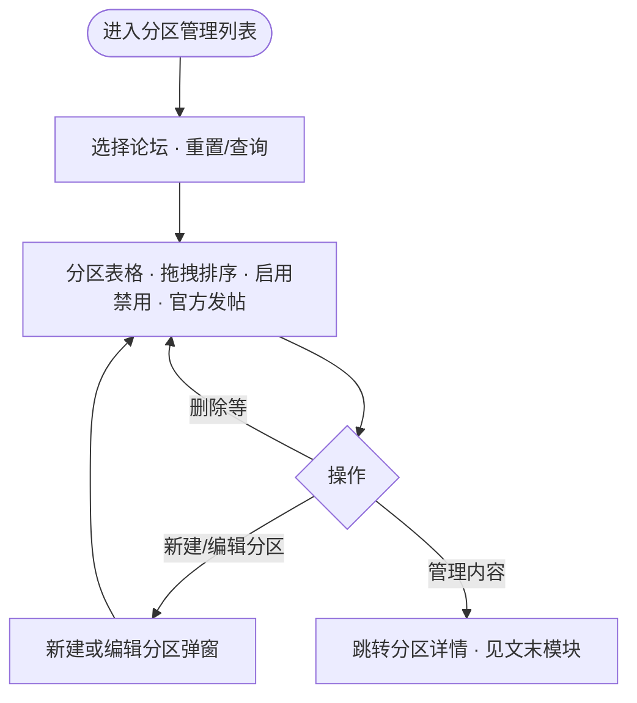

# 分区管理列表页 PRD

**路由**：`/tab-route`（本地示例：`http://localhost:3000/tab-route`）

**范围**：前面写列表与 **编辑分区** 弹窗；文末一段写 **管理内容** 详情页 `/tab-route/[id]`（含带二级 Tab 时怎么切子 Tab、谁负责配模块）。

---

## 背景与目标

- 运营按论坛查看分区列表，通过 **列表拖拽** 调整顺序、**列表开关** 启用/禁用，通过 **「官方」列** 配置是否仅官方账号可在该分区/二级下发帖，通过 **编辑分区弹窗** 维护分区名称（含多语言）、分区类型、二级 Tab 及顺序（**「官方」仅列表配置，弹窗内不提供**）。
- 分区 **名称与类型** 不在表格内直接编辑，避免误操作与列表 UI 臃肿；未保存逻辑仅作用于弹窗内表单（与详情页模块编辑无关）。

---

## 用户使用流程（本页）

---

## 论坛筛选区

进入本页后展示；用于按论坛筛选下方分区列表。

1. **论坛下拉**：按当前论坛筛选分区数据  
   - 交互：展开选择；可清空；「重置」清空并刷新；「查询」按当前选择筛选  
   - 文案：占位「请选择论坛」；按钮「重置」「查询」；标签「论坛：」  
   - 边界：可不选论坛（展示全部或默认数据，与实现一致）

2. **重置**：清空论坛选择并触发查询逻辑 — 文案「重置」

3. **查询**：按当前选中论坛刷新列表 — 文案「查询」

---

## 分区管理列表页

### 1. 面包屑

- 交互：点击「论坛管理」跳转论坛列表；当前「分区管理」不可点  
- 文案：例如「论坛管理 / 分区管理」

### 2. 页头

- 交互：点击「新建」打开「新建分区」弹窗（规则同「编辑分区」）  
- 文案：主标题「分区管理」；按钮「新建」（无副标题）

### 3. 分区列表表格

列：拖拽柄、序号、分区名称、分区类型、**官方**、状态、操作人、操作时间、操作。

- **官方（列表内配置「仅官方可发帖」）**  
  - **含义**：开启后，普通用户无法在该分区（或对应二级范围）发帖，仅官方认证账号可以发帖。  
  - **表头**：文案「官方」；右侧 **问号**，悬停 **Tooltip** 说明（与全局常量 `OFFICIAL_POST_ONLY_TOOLTIP` 一致，当前为：*开启后，普通用户无法在该分区下发帖，仅官方认证账号可以发帖。*）  
  - **固定行「全部」**：单元格为 **「—」**，不可配置。  
  - **一级无二级 Tab**：行内 **Switch**，直接读写一级 `TabRoute.officialPostOnly`（默认关）。  
  - **一级含二级 Tab**：单元格为 **链接式文案「二级 N 项」**（`N` 为 `subTabs` 数量），**点击** 打开 **Popover**；Popover 内按二级 Tab **主展示名** 分行列出，每行一个 **Switch**，分别读写 `TabSubRoute.officialPostOnly`（默认关）。Popover **内无** 额外说明标题文案。  
  - **与弹窗分工**：**一级、二级** 的「仅官方可发帖」**均在列表「官方」列** 操作（无二级用行内 Switch，有二级用 **「二级 N 项」** Popover）；**「编辑分区」弹窗内不提供任何「官方」开关**。弹窗保存时 **`officialPostOnly`** 从当前列表行数据 **合并写回**：有二级按子 Tab **`id`** 合并子级；无二级则合并 **一级** `TabRoute.officialPostOnly`（以列表为准，避免保存名称/类型时覆盖列表里已改的官方开关）。

- **分区名称（表格内只读）**  
  - 不得在表格内改名称；名称在 **「编辑分区」** 弹窗维护。  
  - 列表主文案为 **简体中文 / 主名称**（`name` 与 `nameI18n.zh` 对齐策略见下「数据与展示」）。  
  - 若配置了多个语种，名称列可展示 **旗标**，悬停 Tooltip 查看各语种文案。

- **分区类型（表格内只读）**  
  - **枚举**（与 `TabPartitionLayoutType` 一致）：**`feeds`** → Feeds 流；**`normal-card`** → 普通卡片；**`activity-card`** → 活动卡片（详见下 **「活动卡片与去发帖」**）。  
  - **一级无二级 Tab**：`layoutType` 落在一级；固定行「全部」为只读 Tag；其它行以 **只读 Tag** 展示类型（**不在表格内用 Select 修改**）。当一级为 **活动卡片** 时，类型展示旁可出现 **「去发帖」** 链接。  
  - **一级含二级 Tab**（`subTabs` 非空）：一级 **不使用** `layoutType`；单元格仅展示蓝色 Tag **「二级 N 项」**（`cursor: default`），**主单元格旁不出现「去发帖」**。悬停 **Tooltip** 仅列出各二级 Tab **主展示名 · 分区类型**（**Tooltip 内也不展示「去发帖」**）。

- **排序**：非固定分区行支持左侧 **拖拽** 调整顺序，松手后回写 `sortOrder`。

- **状态**：启用/禁用开关在列表操作（与「名称/类型仅弹窗编辑」不冲突）。

- **操作列**：**「编辑分区」**（弹窗）、**「管理内容」**（跳转分区详情）、删除等（与实现一致）。

- **规则**：未配置类型时前台可按 `feeds` 默认处理（与产品约定一致即可）。

### 3.1 活动卡片与「去发帖」

- **含义**：分区类型为 **活动卡片**（`layoutType === 'activity-card'`）时，运营常需去后台发活动帖；界面提供快捷链 **「去发帖」**，避免只改类型却找不到发帖入口。  
- **文案与样式**：链接文案固定 **「去发帖」**；**分区列表**（一级无二级且为活动卡片）与 **编辑分区弹窗** 为蓝色文字链；**列表「二级 N 项」** 的主格与悬停 Tooltip **均不出现「去发帖」**。**管理内容详情** `/tab-route/[id]` **不提供「去发帖」**。  
- **跳转目标（当前实现）**：组件 `app/components/ActivityCardGoPostLink.tsx`，常量 **`ACTIVITY_CARD_POST_HREF`**，默认 **`/content`**（内容管理方向入口）。注释约定：**可按产品改为「新建帖」等实际路由**，改常量或组件即可。  
- **出现位置（与实现对齐）**：  
  1. **分区列表** `tab-route/page.tsx`：**一级无二级** 且类型为活动卡片 → Tag 旁「去发帖」。**一级含二级** 时，**「二级 N 项」** 及其 **Tooltip 明细** 均 **不** 展示「去发帖」。  
  2. **新建/编辑分区弹窗**：**无二级** 且「分区类型」选 **活动卡片** → 在分区类型表单项 **下方** 展示「去发帖」；**有二级** 且某一行的分区类型选 **活动卡片** → **该行**类型选择器旁展示「去发帖」。  
  3. **管理内容详情** `/tab-route/[id]`：**不** 展示「去发帖」（本页仅配模块，发帖入口只在列表/弹窗）。

### 4. 列表标题栏

- 文案：标题「列表」；数量「N 条」

### 5. 新建 / 编辑分区弹窗

- **数据**：分区 **简体中文名称** 必填（映射为 `name` / `nameI18n.zh`）；可选 **`nameI18n`** 多语种（`LangCode` 与集合页等多语言配置一致）。

- **主表单**：「分区名称（简体中文）」单行输入；输入框 **右侧 `Languages` 图标**（suffix），点击打开 **右侧 Drawer**，内嵌 **`FieldI18nEditor`**（支持 AI 翻译等）。Drawer 使用 antd 推荐的 **`size`（数值）**，**不使用** 已废弃的 **`width`**。

- **水合 / SSR**：Modal **不使用 `forceRender`**，避免 Next.js 与 SSR HTML 不一致；关闭时销毁表单内容（如 `destroyOnHidden`）；打开时通过 `setFieldsValue` 灌数。

- **二级 Tab**：「启用二级 Tab」开关；开启后 **Form.List**（每行一张卡片）：  
  - 子 Tab **简体中文名称** 必填；同 **Languages 图标** 打开 Drawer 维护该子 Tab 的 `nameI18n`。  
  - **分区类型** Select（与前台版式配置一致，如 Feeds 流 / 普通卡片 / 活动卡片等）。  
  - 左侧 **拖拽手柄** 调整子 Tab 顺序，保存时写回 `sortOrder`（**不在列表页 Popover 内排序或改类型**）。  
  - 保存时按子 Tab **`id`** **合并保留** 已有 **`modules`**，避免仅改名称/排序时清空详情侧已配模块。  
  - **不包含**「官方」相关表单项：二级范围的「仅官方可发帖」仅在 **列表「官方」列 →「二级 N 项」Popover** 配置；保存时子级 **`officialPostOnly`** 从当前列表按 `id` 合并，**不** 依赖弹窗。  
  - 某行「分区类型」选 **活动卡片** 时，**该行**旁展示 **「去发帖」**，规则见 **「3.1」**。

- **无二级 Tab 时**：仅展示「分区类型」等字段，**无**「官方」开关；一级 `officialPostOnly` 仍只在 **列表** 配置，保存编辑分区时从列表 **合并** 写回。分区类型选 **活动卡片** 时，在类型选择器 **下方** 展示 **「去发帖」** 链接，规则见下文小节 **3.1（活动卡片与「去发帖」）**。

- **提交规则**：要么写一级 `layoutType` 且无 `subTabs`，要么写 `subTabs` 并清空一级 `layoutType`；有 `subTabs` 时一级 **不写** `officialPostOnly`（由各子项 `officialPostOnly` 表达）。**新建**且无二级时，`officialPostOnly` 默认为关，后续在列表打开。

---

## 数据与展示（与本页相关）

- **`TabRoute`**（列表行）：`id`、`name`、`nameI18n?`、`layoutType?`、`subTabs?`、`sortOrder`、`status`、`officialPostOnly?` 等。  
  - **`officialPostOnly`**：仅在一级 **无** 非空 `subTabs` 时使用；为 `true` 表示该一级分区下仅官方账号可发帖。  
  - **无** 二级 Tab 时可有 `modules?`（列表不编辑模块，仅弹窗合并时需带回）。  
- **`TabSubRoute`**（二级 Tab）：`id`、`name`、`nameI18n?`、`layoutType`、`sortOrder`、`officialPostOnly?`、`modules?`（弹窗保存时按 `id` 合并 `modules` 与列表侧已改的 `officialPostOnly`）。  
- **文案常量**：`app/types/index.ts` 中 `OFFICIAL_POST_ONLY_TOOLTIP`，供 **列表「官方」列** 问号 Tooltip 复用（弹窗、管理内容详情 **不使用**）。  
- **展示名**：`app/lib/tabRouteLocale.ts` — `tabPrimaryDisplayName`、`subTabPrimaryDisplayName` 等；`zh` 与主 `name` 互为回退；列表名称列、分区类型 Tooltip、官方 Popover 内子项名称均用主展示名。

---

## 迭代记录 · 本页（2026-04）

| 主题 | 说明 |
|------|------|
| 列表只读名称/类型 | 表格内不可改分区名与类型；仅弹窗配置。 |
| 多语言 | 分区与子 Tab 支持 `nameI18n`；主表单简体中文 + Languages → Drawer + `FieldI18nEditor`。 |
| 二级 Tab | 顺序与类型仅在弹窗 **Form.List** 内拖拽与 Select；列表只读 Tag + Tooltip。 |
| 官方 · 仅官方可发帖 | 列表增 **「官方」** 列：一级直接 Switch；有二级时 **「二级 N 项」** 点开 Popover 按子 Tab 配置。**编辑分区弹窗、管理内容详情均不提供「官方」**；保存时从列表合并 `officialPostOnly`。 |
| 活动卡片 · 去发帖 | `activity-card` 时在 **一级无二级的列表行**、编辑弹窗展示 **「去发帖」**；**列表「二级 N 项」主格与 Tooltip**、**管理内容详情** 均不展示。默认跳转 `/content`（`ActivityCardGoPostLink`，可改）。见 **「3.1」**。 |
| antd / Next | Modal 去 **`forceRender`**；Drawer 用 **`size`**。 |

---

## 权限（本页）

| 角色 | 功能 |
|------|------|
| [用户填写] | 论坛筛选（选择论坛、重置、查询） |
| [用户填写] | 分区管理列表（查看、新建、编辑分区、启用/禁用、**官方/仅官方可发帖**、拖拽排序、删除、进入分区详情） |

---

## 带二级 Tab 的管理内容（分区详情）

列表点 **「管理内容」** 进入 **`/tab-route/[id]`**（实现：`TabEditPageClient.tsx`）。

若该分区在 **编辑分区** 里启用了二级 Tab：页面上方用 **Segmented** 切换子 Tab（如综合 / 资讯…），**每个子 Tab 一套模块列表**，互不影响；子 Tab 名称、顺序、每个子 Tab 的版式类型仍在 **编辑分区** 里改，本页只管 **配模块**。模块 **增、改** 即时生效（无「保存」按钮）；**删模块** 仍二次确认。

- **本页不提供**：**「去发帖」** 链接（活动卡片也不在标题区 / Segmented 旁展示）；**「官方 / 仅官方可发帖」** 开关。上述均在 **分区管理列表** 或 **编辑分区弹窗** 配置（官方仅列表），见上文 **「官方」** 与 **「3.1」**。

无二级 Tab 的分区也用同一详情页：标题区可保留 **分区类型** Tag（只读示意），**无**「去发帖」与「官方」控件。

---

## 数据监测

[用户填写]
