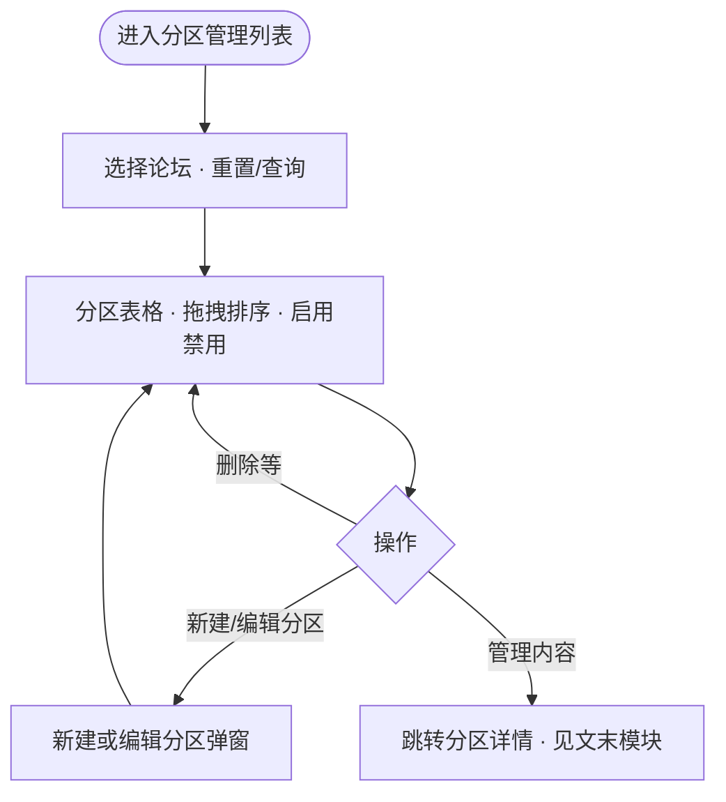

# 分区管理列表页 PRD

**路由**：`/tab-route`（本地示例：`http://localhost:3000/tab-route`）

**范围**：前面写列表与 **编辑分区** 弹窗；文末一段写 **管理内容** 详情页 `/tab-route/[id]`（含带二级 Tab 时怎么切子 Tab、谁负责配模块）。

---

## 背景与目标

- 运营按论坛查看分区列表，通过 **列表拖拽** 调整顺序、**列表开关** 启用/禁用，通过 **编辑分区弹窗** 维护分区名称（含多语言）、分区类型、二级 Tab 及顺序。
- 分区 **名称与类型** 不在表格内直接编辑，避免误操作与列表 UI 臃肿；未保存逻辑仅作用于弹窗内表单（与详情页模块编辑无关）。

---

## 用户使用流程（本页）

---

## 论坛筛选区

进入本页后展示；用于按论坛筛选下方分区列表。

1. **论坛下拉**：按当前论坛筛选分区数据  
   - 交互：展开选择；可清空；「重置」清空并刷新；「查询」按当前选择筛选  
   - 文案：占位「请选择论坛」；按钮「重置」「查询」；标签「论坛：」  
   - 边界：可不选论坛（展示全部或默认数据，与实现一致）

2. **重置**：清空论坛选择并触发查询逻辑 — 文案「重置」

3. **查询**：按当前选中论坛刷新列表 — 文案「查询」

---

## 分区管理列表页

### 1. 面包屑

- 交互：点击「论坛管理」跳转论坛列表；当前「分区管理」不可点  
- 文案：例如「论坛管理 / 分区管理」

### 2. 页头

- 交互：点击「新建」打开「新建分区」弹窗（规则同「编辑分区」）  
- 文案：主标题「分区管理」；按钮「新建」（无副标题）

### 3. 分区列表表格

列：拖拽柄、序号、分区名称、分区类型、状态、操作人、操作时间、操作。

- **分区名称（表格内只读）**  
  - 不得在表格内改名称；名称在 **「编辑分区」** 弹窗维护。  
  - 列表主文案为 **简体中文 / 主名称**（`name` 与 `nameI18n.zh` 对齐策略见下「数据与展示」）。  
  - 若配置了多个语种，名称列可展示 **旗标**，悬停 Tooltip 查看各语种文案。

- **分区类型（表格内只读）**  
  - **`feeds`**：**Feeds 流**；**`card-grid`**：**卡片网格**。  
  - **一级无二级 Tab**：`layoutType` 落在一级；固定行「全部」为只读 Tag；其它行以 **只读 Tag** 展示类型（**不在表格内用 Select 修改**）。  
  - **一级含二级 Tab**（`subTabs` 非空）：一级 **不使用** `layoutType`；单元格展示蓝色 Tag **「二级 N 项」**（`cursor: default`）。悬停 **Tooltip** 列出各二级 Tab **主展示名 · 分区类型**。

- **排序**：非固定分区行支持左侧 **拖拽** 调整顺序，松手后回写 `sortOrder`。

- **状态**：启用/禁用开关在列表操作（与「名称/类型仅弹窗编辑」不冲突）。

- **操作列**：**「编辑分区」**（弹窗）、**「管理内容」**（跳转分区详情）、删除等（与实现一致）。

- **规则**：未配置类型时前台可按 `feeds` 默认处理（与产品约定一致即可）。

### 4. 列表标题栏

- 文案：标题「列表」；数量「N 条」

### 5. 新建 / 编辑分区弹窗

- **数据**：分区 **简体中文名称** 必填（映射为 `name` / `nameI18n.zh`）；可选 **`nameI18n`** 多语种（`LangCode` 与集合页等多语言配置一致）。

- **主表单**：「分区名称（简体中文）」单行输入；输入框 **右侧 `Languages` 图标**（suffix），点击打开 **右侧 Drawer**，内嵌 **`FieldI18nEditor`**（支持 AI 翻译等）。Drawer 使用 antd 推荐的 **`size`（数值）**，**不使用** 已废弃的 **`width`**。

- **水合 / SSR**：Modal **不使用 `forceRender`**，避免 Next.js 与 SSR HTML 不一致；关闭时销毁表单内容（如 `destroyOnHidden`）；打开时通过 `setFieldsValue` 灌数。

- **二级 Tab**：「启用二级 Tab」开关；开启后 **Form.List**（每行一张卡片）：  
  - 子 Tab **简体中文名称** 必填；同 **Languages 图标** 打开 Drawer 维护该子 Tab 的 `nameI18n`。  
  - **分区类型** Select（Feeds 流 / 卡片网格）。  
  - 左侧 **拖拽手柄** 调整子 Tab 顺序，保存时写回 `sortOrder`（**不在列表页 Popover 内排序或改类型**）。  
  - 保存时按子 Tab **`id`** **合并保留** 已有 **`modules`**，避免仅改名称/排序时清空详情侧已配模块。

- **提交规则**：要么写一级 `layoutType` 且无 `subTabs`，要么写 `subTabs` 并清空一级 `layoutType`。

---

## 数据与展示（与本页相关）

- **`TabRoute`**（列表行）：`id`、`name`、`nameI18n?`、`layoutType?`、`subTabs?`、`sortOrder`、`status` 等；**无** 二级 Tab 时可有 `modules?`（列表不编辑模块，仅弹窗合并时需带回）。  
- **`TabSubRoute`**（二级 Tab）：`id`、`name`、`nameI18n?`、`layoutType`、`sortOrder`、`modules?`（弹窗保存时按 `id` 合并）。  
- **展示名**：`app/lib/tabRouteLocale.ts` — `tabPrimaryDisplayName`、`subTabPrimaryDisplayName` 等；`zh` 与主 `name` 互为回退；列表名称列与子 Tab Tooltip 使用主展示名。

---

## 迭代记录 · 本页（2026-04）

| 主题 | 说明 |
|------|------|
| 列表只读名称/类型 | 表格内不可改分区名与类型；仅弹窗配置。 |
| 多语言 | 分区与子 Tab 支持 `nameI18n`；主表单简体中文 + Languages → Drawer + `FieldI18nEditor`。 |
| 二级 Tab | 顺序与类型仅在弹窗 **Form.List** 内拖拽与 Select；列表只读 Tag + Tooltip。 |
| antd / Next | Modal 去 **`forceRender`**；Drawer 用 **`size`**。 |

---

## 权限（本页）

| 角色 | 功能 |
|------|------|
| [用户填写] | 论坛筛选（选择论坛、重置、查询） |
| [用户填写] | 分区管理列表（查看、新建、编辑分区、启用/禁用、拖拽排序、删除、进入分区详情） |

---

## 带二级 Tab 的管理内容（分区详情）

列表点 **「管理内容」** 进入 **`/tab-route/[id]`**（实现：`TabEditPageClient.tsx`）。

若该分区在 **编辑分区** 里启用了二级 Tab：页面上方用 **Segmented** 切换子 Tab（如综合 / 资讯…），**每个子 Tab 一套模块列表**，互不影响；子 Tab 名称、顺序、每个子 Tab 的 Feeds/卡片网格仍在 **编辑分区** 里改，本页只管 **配模块**。模块 **增、改** 即时生效（无「保存」按钮）；**删模块** 仍二次确认。

无二级 Tab 的分区也用同一详情页，只是没有 Segmented。

---

## 数据监测

[用户填写]
