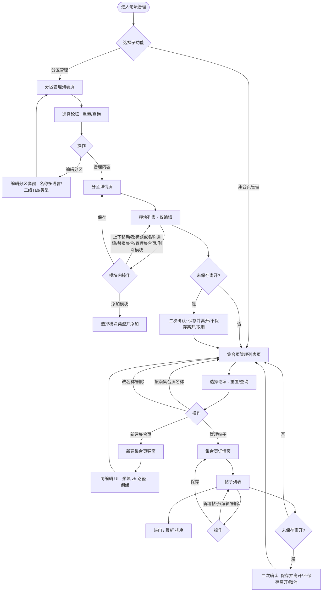

# 分区管理与集合页管理 PRD

# 背景

论坛后台需要统一管理「分区」（如攻略、官方、交流等 Tab）与「集合页」（聚合多篇帖子的专题页）。分区决定前台 Tab 结构与模块顺序，集合页决定每个专题下的帖子与封面。为降低运营成本、保证前台展示一致，需在后台提供分区管理（配置模块与集合项）与集合页管理（配置帖子与封面）能力，并与论坛维度联动（按论坛筛选数据）。

# 目标

- 运营可在后台按论坛查看与配置分区列表及分区下的模块与集合项，无需改代码即可调整前台 Tab 与模块顺序。
- 运营可在后台按论坛查看与配置集合页列表及每个集合页内的帖子与封面，支持增删改与排序（热门/最新）。
- 分区与集合页的修改经「保存」后生效，未保存离开时有二次确认，减少误操作与数据不一致。

# 需求

## 原型

[用户填写原型地址]

## 用户使用流程

## 论坛筛选区

说明：筛选区在进入「分区管理」或「集合页管理」子功能后展示，不在论坛管理首页展示；进入对应列表页后再选择论坛进行筛选。

1. **论坛下拉**：按当前论坛筛选分区/集合页数据
   - 交互：点击展开下拉；选择某一论坛后选项收起；支持清空选择；点击「重置」清空选择并刷新；点击「查询」按当前选择筛选
   - 状态：默认未选择；已选择某一论坛；已查询（列表按所选论坛展示）
   - 规则：选项列表为预置论坛列表；重置后不保留上次选择
   - 文案：占位「请选择论坛」；按钮「重置」「查询」；标签「论坛：」
   - 边界：可不选论坛（展示全部或默认数据）

2. **重置按钮**：清空论坛选择并触发筛选
   - 交互：点击后下拉恢复未选状态，并触发一次查询逻辑
   - 文案：「重置」

3. **查询按钮**：按当前选择的论坛执行筛选
   - 交互：点击后列表按当前选中论坛刷新
   - 文案：「查询」

## 分区管理列表页

1. **面包屑**：展示当前层级路径，仅前置层级可点击
   - 交互：点击「论坛管理」跳转论坛列表；当前页「分区管理」不可点
   - 规则：最后一级为当前页，不提供链接
   - 文案：例如「论坛管理 / 分区管理」

2. **页头**：标题与「新建」
   - 交互：点击「新建」打开「新建分区」弹窗（表单规则同「编辑分区」）
   - 文案：主标题「分区管理」；副标题「管理游戏社区的内容分区及其排序」；按钮「新建」

3. **分区列表表格**：展示拖拽柄、序号、分区名称、**分区类型**、状态、操作人、操作时间、操作
   - **分区名称（只读表格内编辑）**：
     - **不得在表格内**改名称、改类型；名称与类型的增删改均在 **「编辑分区」** 弹窗完成。
     - 列表主文案为 **简体中文 / 主名称**（`name` 与 `nameI18n.zh` 对齐策略见下「数据与多语言」）；若配置了多个语种，名称列可展示 **旗标**，悬停 Tooltip 查看各语种文案。
   - **分区类型**（只读展示）：
     - **`feeds`**：**Feeds 流**；**`card-grid`**：**卡片网格**（含义同前版 PRD）。
     - **一级无二级 Tab**：`layoutType` 落在一级分区；固定行「全部」为只读 Tag；其它行以 **只读 Tag** 展示当前类型（**不在表格内用 Select 修改**）。
     - **一级含二级 Tab**（`subTabs` 非空）：一级 **不使用** `layoutType`；单元格展示蓝色 Tag **「二级 N 项 · 编辑分区内配置」**（`cursor: default`）。悬停 **Tooltip** 仅列出各二级 Tab **主展示名 · 分区类型**，**不展示**引导性说明文案。
   - **排序**：非固定分区行支持左侧 **拖拽** 调整顺序，松手后回写 `sortOrder`。
   - **状态**：启用/禁用开关仍可在列表操作（与「仅编辑分区改名称/类型」不冲突）。
   - 操作列：**「编辑分区」**（弹窗）、**「管理内容」**（分区详情 / 模块页）、删除等。
   - 规则：未配置时前台可按 `feeds` 默认处理。

4. **列表标题栏**：列表区块标题与数量
   - 文案：标题「列表」；数量标签「N 条」

5. **新建/编辑分区弹窗**（核心）
   - **数据**：分区 **简体中文名称** 必填（映射为 `name` / `nameI18n.zh`）；可选 **`nameI18n`** 多语种（与集合页 `nameI18n` 同一套 `LangCode`）。
   - **主表单**：「分区名称（简体中文）」**单行输入**；输入框 **右侧 `Languages` 图标**（suffix），点击打开 **右侧 Drawer**，内嵌 **`FieldI18nEditor`**：维护全部支持语种 + **AI 翻译**；Drawer 宽度使用 antd 6 推荐的 **`size`（数值）**，**禁止**使用已废弃的 **`width`**。
   - **水合 / SSR**：Modal **不使用 `forceRender`**（避免 `open=false` 时预渲染 Portal 导致 Next.js 与 SSR HTML 不一致）；依赖 `destroyOnHidden` 在关闭时销毁表单；打开弹窗前/后通过 `setFieldsValue` 灌数。
   - **二级 Tab**：**启用二级 Tab** 开关；开启后展示 **Form.List**（每卡片一行）：
     - **简体中文名称** 必填；同 **Languages 图标** 打开 Drawer 维护该子 Tab 的 `nameI18n`。
     - **分区类型** Select（Feeds 流 / 卡片网格）。
     - 左侧 **拖拽手柄** 调整子 Tab 顺序，保存时写回 `sortOrder`（**不在列表页 Popover 内排序或改类型**）。
     - 保存时按子 Tab **`id`** 合并保留已有 **`modules`**，避免仅改名称时清空模块。
   - **提交**：要么写一级 `layoutType` 且无 `subTabs`，要么写 `subTabs` 并清空一级 `layoutType`。

## 分区详情页（攻略等）

支持 **编辑 / 预览** 切换（Segmented）；模块列表可折叠、内联预览等（与实现一致）。

1. **面包屑**：当前路径，前置可点
   - 交互：点击「论坛管理」或「分区管理」跳转；当前分区名不可点
   - 文案：例如「论坛管理 / 分区管理 / 攻略」；标题与面包屑最后一级使用 **分区主展示名**（`tabPrimaryDisplayName`，含 `nameI18n` 回退）。
   - **有二级 Tab 时**：页头 Tag 文案形如 **「二级 Tab N 个 · 分区类型在子 Tab；模块按子 Tab 单独配置」**；无二级 Tab 时展示一级分区类型 Tag。

2. **页头**：分区标题、编辑/预览 Segmented、保存、添加模块
   - 交互：有未保存修改时显示「保存」，点击后持久化并提示成功；点击「添加模块」打开模块类型选择弹窗
   - 状态：有修改时显示保存按钮，保存后隐藏
   - 规则：仅存在未保存修改时显示保存按钮；保存后前台按当前配置展示
   - 文案：按钮「保存」「添加模块」
   - 边界：未保存时通过侧栏或面包屑离开会触发二次确认
   - **路由**：`/tab-route/[id]` 对详情客户端根节点使用 **`key={id}`**，切换分区时重置本地模块编辑状态，避免沿用上一条分区的 `modulesByKey`。

3. **二级 Tab 与模块（仅当分区存在 `subTabs`）**
   - 在模块编辑区 **上方** 展示 **Segmented**（或同类切换器），按 `sortOrder` 排列子 Tab；文案提示用户 **当前正在为哪一子 Tab 配置模块**。
   - **每个二级 Tab 拥有独立的模块列表**（数据结构为按子 Tab `id` 分桶的 `ContentModule[]`，与一级无子 Tab 时单列表语义一致）。
   - **未保存 / 保存**：脏检查与保存快照覆盖 **当前分区下所有子 Tab** 的模块集合；保存成功提示与离开守卫逻辑与单列表分区一致。
   - **空状态**：无模块时可展示「当前子 Tab 主展示名下暂无模块…」（`subTabPrimaryDisplayName`）。
   - **实现说明**：列表 mock 中「攻略」等无子 Tab 分区的模块挂在 `TabRoute.modules`；「官方」等子 Tab 模块挂在 `TabSubRoute.modules`，保存编辑分区时需按 `id` 合并保留。

4. **模块卡片**：每个模块为一块可折叠区域，含类型标签、标题区、操作（含 **预览** 入口，与「编辑/预览」整页模式并存时可内联预览）
   - 交互：点击上/下箭头调整模块顺序（首行上箭头、末行下箭头禁用）；非「单篇集合页」的模块点击标题区可内联编辑模块名称；点击删除图标二次确认后删除模块；点击右侧箭头折叠/展开模块内容；可按 **眼睛图标** 展开/收起内联预览条
   - 状态：折叠/展开；标题编辑中/展示中
   - 规则：单篇集合页不展示可编辑的模块名，仅展示所选集合页名称或「请选择集合页」；其他模块名称为选填，空时展示「名称（选填）」，编辑时占位「名称（选填）」；新增模块默认无名称；模块顺序即时变更，需点「保存」后生效
   - 文案：删除确认「确认删除该模块？」「删除」「取消」；名称空时「名称（选填）」；单篇集合页未选时「请选择集合页」
   - 边界：第一个模块不能上移，最后一个不能下移

5. **单篇集合页模块**：仅配置一个集合页，无独立模块名，直接使用集合页名称
   - 交互：未选集合页时底部显示「添加集合页」，通过可搜索下拉选择已有集合页添加；已选一个时展示该行（集合页名称、链接、修改时间、操作人、文章数），名称旁「修改」图标可替换为其他集合页，链接可点击外链，点击「管理集合页」图标跳转至该集合页的帖子管理页（未保存时先二次确认）；可移除该条后重新选择
   - 状态：已选 0 个或 1 个集合页；仅当 0 个时显示添加入口
   - 规则：每次只能存在一个集合项；替换与添加均从当前可选集合页列表中选择；管理集合页跳转前若有未保存修改会弹离开确认
   - 文案：表头「集合页名称」「链接」「修改时间」「操作人」「文章数」；操作「管理集合页」；底部「添加集合页」；类型标签「单篇集合页」
   - 边界：未匹配到集合页时提示需先在集合页管理中创建

6. **集合页网格模块**：以网格形式展示多个集合项，含封面列，选填可不添加
   - 交互：表头含「封面」「集合页名称」「链接」「修改时间」「操作人」「文章数」；每行可替换集合页、编辑封面（本地上传并裁切或默认占位）、点击「管理集合页」跳转帖子管理；底部「添加集合页」通过下拉选择添加
   - 状态：封面为空时显示默认占位图
   - 规则：集合项可选填，可不添加；封面支持本地上传并裁切，比例固定
   - 文案：类型标签「集合页网格」；描述含「选填，可不添加」；封面编辑「上传图片（可裁切）」
   - 边界：同单篇集合页，未匹配时提示先在集合页管理中创建

7. **帖子网格模块**：配置帖子卡片与列数
   - 交互：可配置每行 2/3/6 列；可增删帖子条目（标题、缩略图、链接）
   - 规则：布局选项为每行 2 列、每行 3 列、每行 6 列
   - 文案：布局选项「每行 2 列」「每行 3 列」「每行 6 列」
   - 边界：无

8. **添加模块弹窗**：选择要添加的模块类型
   - 交互：展示三种类型（单篇集合页、集合页网格、帖子网格），点击某一项即添加该类型模块并关闭弹窗；新模块默认无名称（名称为选填）
   - 规则：新模块追加到列表末尾；单篇集合页仅配置一个集合页，集合页网格可选填
   - 文案：标题「添加模块」；类型名称「单篇集合页」「集合页网格」「帖子网格」及各自描述
   - 边界：无

9. **空状态**：无模块时展示
   - 文案：「暂无模块」「点击「添加模块」开始配置」

10. **离开二次确认**：有未保存修改时通过侧栏、面包屑或页面内跳转离开
   - 交互：弹出确认框，可选「保存并离开」「不保存离开」「取消」
   - 文案：标题「未保存的修改」；内容「当前有未保存的修改，是否保存后再离开？」；按钮「保存并离开」「不保存离开」「取消」
   - 边界：仅在有未保存修改时触发；关闭/刷新浏览器时由浏览器原生提示

## 集合页管理列表页

1. **面包屑**：同分区管理列表，当前为「集合页管理」
   - 文案：例如「论坛管理 / 集合页管理」

2. **页头**：标题、数量与新建
   - 交互：点击「新建集合页」打开新建弹窗
   - 文案：主标题「集合页管理」；副标题「管理各集合页内的帖子及封面图」；数量「N 个」位于主标题右侧；按钮「新建集合页」
   - 边界：数量与列表总数一致

3. **搜索**：按集合页名称筛选列表
   - 交互：输入关键词实时过滤表格；支持清空；不区分大小写
   - 规则：名称包含关键词即展示；空关键词展示全部
   - 文案：占位「搜索集合页名称」
   - 边界：无

4. **集合页表格**：集合页名称、链接、隐藏、帖子数、操作
   - 交互：名称列含主名称、隐藏/未命名等标签及多语言查看图标；**链接**为主链接可点击，悬停 Tooltip 展示各语种路径；**隐藏**列为开关，切换后立即落库；**帖子数**悬停可看各语种条数；点击「管理帖子」进入帖子管理；点击「编辑」打开多语言名称与链接配置弹窗；点击删除图标二次确认后删除该集合页
   - 规则：名称、链接、帖子数、隐藏状态来自数据；删除后不可恢复；分区模块中配置的集合页链接与集合页**任一语种路径**一致即可匹配（见《PRD-集合页多语言与按语种帖子》）
   - 文案：列头「集合页名称」「链接」「隐藏」「帖子数」「操作」；操作「管理帖子」「编辑」；链接为空时「未设置」；删除确认「确认删除「xxx」？」「删除后数据不可恢复」「删除」「取消」
   - 边界：无

5. **新建集合页弹窗**：与「编辑集合页」**同一套 UI**（浅蓝说明 + AI 翻译名称、**\* 集合页配置** 动态行：语种 / 名称 / 链接 / 删除、**+ 添加语种**、取消 + 主按钮）
   - 交互：打开时预填一行 **简体中文**，链接默认为 **`/zh/collection/N`**（N 为下一个可用序号，可改）；可添加其它语种并填写名称与路径后点击 **「创建」** 落库
   - 规则：校验规则与编辑一致（至少一行名称、至少一行路径）；创建后写入 `name` / `nameI18n` / `link` / `linkI18n` 与空的中文帖子桶
   - 文案：标题「新建集合页」；主按钮为 **「创建」**（编辑弹窗为「确定」）
   - 边界：同编辑弹窗的多语言行规则

## 集合页详情页（帖子管理）

1. **面包屑**：当前为某集合页名称
   - 文案：例如「论坛管理 / 集合页管理 / 武器攻略」

2. **页头**：集合页名称、帖子数、保存与新增帖子
   - 交互：有未保存修改时显示「保存」，点击后同步到前台并提示成功；点击「新增帖子」打开新增帖子弹窗
   - 状态：有/无未保存修改；有则显示保存按钮
   - 规则：增删改帖子仅改本地，点「保存」后才写入并影响前台；列表顺序由「热门」或「最新」自动排序决定，不支持手动拖拽排序
   - 文案：副标题「共 N 篇帖子」；按钮「保存」「新增帖子」
   - 边界：未保存时离开会二次确认

3. **帖子列表**：区块标题左侧固定，排序选项在右侧；列表按所选排序展示
   - 交互：区块标题为「帖子列表」（不可点）；右侧为「热门」「最新」两个排序入口，分段样式，选中项高亮；切换后列表按浏览量降序（热门）或发布日期降序（最新）重排；每条可点击封面或「编辑」打开编辑弹窗，点击删除二次确认后从列表中移除
   - 状态：排序为「热门」或「最新」；无拖拽把手，列表顺序仅由排序规则决定
   - 规则：热门按浏览量降序，最新按发布日期降序；顺序与增删改仅在点击「保存」后生效
   - 文案：区块标题「帖子列表」；排序「热门」「最新」；每条展示标题、链接、作者、浏览量、日期；按钮「编辑」；删除确认「确认删除该帖子？」「删除」「取消」；新增/编辑后提示「已添加，请点击保存使前台生效」等
   - 边界：无帖子时提示「暂无帖子，点击「新增帖子」添加」

4. **新增/编辑帖子弹窗**：配置帖子链接与封面
   - 交互：帖子链接必填；封面支持「自动取首图」（模拟）或「本地上传」；本地上传可裁切；提交后关闭并更新列表（未保存，需点页头「保存」）
   - 状态：新建/编辑；封面模式：自动取首图 / 本地上传
   - 规则：链接必填；封面为空时使用默认占位图
   - 文案：标题「新增帖子」「编辑帖子」；标签「帖子链接」「封面图」；占位「请输入帖子链接，例如 /posts/12345」；封面模式「自动取首图」「本地上传」；按钮「添加」「保存」「取消」
   - 边界：无

5. **离开二次确认**：与分区详情页逻辑一致，有未保存修改时离开弹确认
   - 文案：同分区详情页
   - 边界：关闭/刷新由浏览器原生提示

## 数据模型与工具（分区 · 与实现对齐）

- **`TabRoute`**：`id`、`name`、`nameI18n?`（`I18nLabels`，与集合页一致）、`layoutType?`、`subTabs?`、`modules?`（仅当 **无** 二级 Tab 时挂一级模块）、`sortOrder`、`status` 等。
- **`TabSubRoute`**：`id`、`name`、`nameI18n?`、`layoutType`、`sortOrder`、`modules?`（该子 Tab 下模块）。
- **展示名**：前端工具方法见 `app/lib/tabRouteLocale.ts`（如 `mergeTabNameI18n`、`tabPrimaryDisplayName`、`mergeSubTabNameI18n`、`subTabPrimaryDisplayName`、`pruneTabNameI18n`），规则：`zh` 与主 `name` 互为回退；列表/详情标题与子 Tab 切换器使用主展示名。

## 迭代记录 · 分区管理（2026-04）

| 主题 | 说明 |
|------|------|
| 列表只读名称/类型 | 表格内不可改分区名与分区类型；仅「编辑分区」弹窗配置。 |
| 多语言 | 分区与子 Tab 均支持 `nameI18n`；弹窗主表单单列简体中文 + 右侧 **Languages** 打开 Drawer + `FieldI18nEditor`。 |
| 二级 Tab 排序与类型 | 子 Tab 顺序与类型仅在弹窗 **Form.List** 内拖拽与 Select 配置；列表仅只读 Tag + Tooltip。 |
| 二级 Tab 模块 | 详情页按子 Tab **分桶**维护模块；保存覆盖全部分桶；`key={id}` 防串分区状态。 |
| antd / Next | Modal 去 **`forceRender`** 修复水合；Drawer 使用 **`size`** 替代废弃 **`width`**。 |

## 权限

| 角色 | 功能 |
|------|------|
| [用户填写] | 论坛筛选（选择论坛、重置、查询） |
| [用户填写] | 分区管理列表（查看、新建、编辑分区、启用/禁用、拖拽排序、删除、进入分区详情） |
| [用户填写] | 分区详情（按子 Tab 配置模块、模块增删改、单篇集合页仅一个集合项、集合项替换与添加、管理集合页跳转、保存、编辑/预览、离开确认） |
| [用户填写] | 集合页管理列表（查看、搜索、新建、编辑多语言名称与链接、隐藏开关、删除、进入帖子管理） |
| [用户填写] | 集合页详情（帖子增删改、热门/最新排序、封面编辑、保存、离开确认） |

## 数据监测

> 提示：请说明验证目标达成所需的数据指标，以及监测系统/功能运行情况需要长期跟踪的数据指标。

[用户填写]
