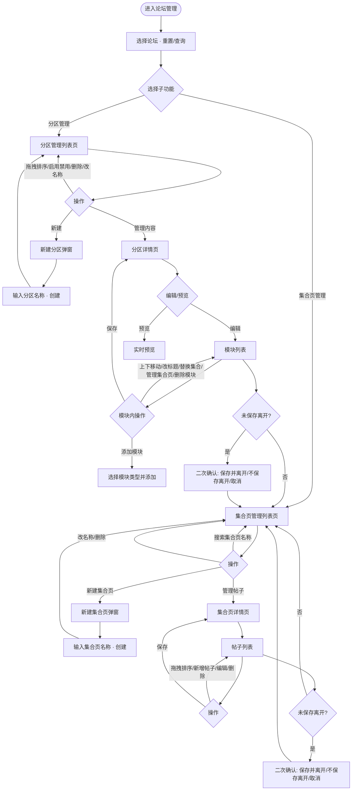

# 分区管理与集合页管理 PRD

# 背景

> 提示：请说明需求来源和需求产生的场景，清晰描述需求背景。

[用户填写]

# 目标

> 提示：请定义可量化的目标，能够直接明确地根据目标验证需求完成情况。目标应具体、可衡量、可验证。

[用户填写]

# 需求

## 原型

[用户填写原型地址]

## 用户使用流程

## 论坛筛选区

1. **论坛下拉**：按当前论坛筛选分区/集合页数据
   - 交互：点击展开下拉；选择某一论坛后选项收起；支持清空选择；点击「重置」清空选择并刷新；点击「查询」按当前选择筛选
   - 状态：默认未选择；已选择某一论坛；已查询（列表按所选论坛展示）
   - 规则：选项列表为预置论坛列表；重置后不保留上次选择
   - 文案：占位「请选择论坛」；按钮「重置」「查询」；标签「论坛：」
   - 边界：可不选论坛（展示全部或默认数据）

2. **重置按钮**：清空论坛选择并触发筛选
   - 交互：点击后下拉恢复未选状态，并触发一次查询逻辑
   - 文案：「重置」

3. **查询按钮**：按当前选择的论坛执行筛选
   - 交互：点击后列表按当前选中论坛刷新
   - 文案：「查询」

## 分区管理列表页

1. **面包屑**：展示当前层级路径，仅前置层级可点击
   - 交互：点击「论坛管理」跳转论坛列表；当前页「分区管理」不可点
   - 规则：最后一级为当前页，不提供链接
   - 文案：例如「论坛管理 / 分区管理」

2. **页头**：标题与新建入口
   - 交互：点击「新建」打开新建分区弹窗
   - 文案：主标题「分区管理」；副标题「管理游戏社区的内容分区及其排序」；按钮「新建」
   - 边界：无

3. **分区列表表格**：展示序号、分区名称、状态、操作人、操作时间、操作
   - 交互：
     - 非固定行可拖拽排序，拖拽时行半透明
     - 分区名称旁点击铅笔进入内联编辑，输入后点「确认」保存、点「取消」或 Esc 放弃
     - 状态列为开关，切换即启用/禁用，并更新操作时间
     - 点击「管理内容」进入该分区详情页（有未保存修改时先二次确认）
     - 点击删除图标弹出二次确认，确认后删除该分区并重排序号
   - 状态：固定项（如「全部」）不可拖拽、不可编辑名称、不可切换状态、操作列为「—」；非固定项可编辑、可删、可拖拽
   - 规则：固定项始终排第一；删除后非固定项序号重排；启用/禁用后更新操作时间
   - 文案：列头「序号」「分区名称」「状态」「操作人」「操作时间」「操作」；状态「已启用」「未启用」「固定项」；操作「管理内容」；删除确认「确认删除该分区？」「确定要删除「xxx」吗？」「删除」「取消」
   - 边界：至少保留固定项；悬停「管理内容」显示「进入配置集合页与模块顺序」

4. **列表标题栏**：列表区块标题与数量
   - 文案：标题「列表」；数量标签「N 条」

5. **新建/编辑分区弹窗**：创建或编辑分区名称
   - 交互：打开后输入分区名称；必填校验；提交后关闭并刷新列表；取消关闭不保存
   - 状态：新建（标题「新建分区」、提交「创建」）；编辑（标题「编辑分区」、提交「保存」）
   - 规则：分区名称必填
   - 文案：占位「例如：攻略、官方、讨论」；标签「分区名称」；校验「请输入分区名称」
   - 边界：无

## 分区详情页（攻略等）

1. **面包屑**：当前路径，前置可点
   - 交互：点击「论坛管理」或「分区管理」跳转；当前分区名不可点
   - 文案：例如「论坛管理 / 分区管理 / 攻略」

2. **页头**：分区标题与视图切换、保存、添加模块
   - 交互：切换「编辑」「预览」切换编辑区与预览区；有未保存修改时显示「保存」，点击后持久化并提示成功；点击「添加模块」打开模块类型选择弹窗
   - 状态：编辑模式 / 预览模式；有修改时显示保存按钮，保存后隐藏
   - 规则：仅存在未保存修改时显示保存按钮；保存后前台按当前配置展示
   - 文案：分段「编辑」「预览」；按钮「保存」「添加模块」
   - 边界：未保存时通过侧栏或面包屑离开会触发二次确认

3. **模块卡片**：每个模块为一块可折叠区域，含类型标签、标题、操作
   - 交互：点击上/下箭头调整模块顺序（首行上箭头、末行下箭头禁用）；点击标题区域可内联编辑标题；点击眼睛图标展开/收起该模块预览；点击删除图标二次确认后删除模块；点击右侧箭头折叠/展开模块内容
   - 状态：折叠/展开；是否处于预览高亮；标题编辑中/展示中
   - 规则：模块顺序即时变更，需点「保存」后生效
   - 文案：删除确认「确认删除该模块？」「删除」「取消」
   - 边界：第一个模块不能上移，最后一个不能下移

4. **集合页列表模块**：列表形式展示集合项（名称、链接、修改时间、操作人、文章数、操作）
   - 交互：每行集合项名称旁有「修改」图标，点击后展开可搜索下拉，选择其他集合页可替换当前行的名称与链接；底部「添加集合页」点击后同样通过下拉选择已有集合页添加一行；链接可点击外链；点击「管理集合页」图标跳转至该集合页的帖子管理页（未保存时先二次确认）
   - 规则：替换与添加均从当前可选集合页列表中选择；管理集合页跳转前若有未保存修改会弹离开确认
   - 文案：表头「集合页名称」「链接」「修改时间」「操作人」「文章数」；操作「管理集合页」；底部「添加集合页」
   - 边界：未匹配到集合页时提示需先在集合页管理中创建

5. **集合页网格模块**：比列表多「封面」列，支持封面编辑
   - 交互：与集合页列表类似，另有封面列；点击封面可上传图片并裁切，或使用默认占位；替换、添加、管理集合页逻辑同列表模块
   - 状态：封面为空时显示默认占位图
   - 规则：封面支持本地上传并裁切，比例固定
   - 文案：同集合页列表，多「封面」列；封面编辑「上传图片（可裁切）」
   - 边界：同集合页列表

6. **帖子网格模块**：配置帖子卡片与列数
   - 交互：可配置每行 2/3/6 列；可增删帖子条目（标题、缩略图、链接）
   - 规则：布局选项为每行 2 列、每行 3 列、每行 6 列
   - 文案：布局选项「每行 2 列」「每行 3 列」「每行 6 列」
   - 边界：无

7. **添加模块弹窗**：选择要添加的模块类型
   - 交互：展示三种类型（集合页列表、集合页网格、帖子网格），点击某一项即添加该类型模块并关闭弹窗
   - 规则：新模块追加到列表末尾
   - 文案：标题「添加模块」；类型名称及描述见类型配置（集合页列表、集合页网格、帖子网格及各自描述）
   - 边界：无

8. **空状态**：无模块时展示
   - 文案：「暂无模块」「点击「添加模块」开始配置」

9. **离开二次确认**：有未保存修改时通过侧栏、面包屑或页面内跳转离开
   - 交互：弹出确认框，可选「保存并离开」「不保存离开」「取消」
   - 文案：标题「未保存的修改」；内容「当前有未保存的修改，是否保存后再离开？」；按钮「保存并离开」「不保存离开」「取消」
   - 边界：仅在有未保存修改时触发；关闭/刷新浏览器时由浏览器原生提示

## 集合页管理列表页

1. **面包屑**：同分区管理列表，当前为「集合页管理」
   - 文案：例如「论坛管理 / 集合页管理」

2. **页头**：标题、数量与新建
   - 交互：点击「新建集合页」打开新建弹窗
   - 文案：主标题「集合页管理」；副标题「管理各集合页内的帖子及封面图」；数量「N 个」；按钮「新建集合页」
   - 边界：数量与列表总数一致

3. **搜索**：按集合页名称筛选列表
   - 交互：输入关键词实时过滤表格；支持清空；不区分大小写
   - 规则：名称包含关键词即展示；空关键词展示全部
   - 文案：占位「搜索集合页名称」
   - 边界：无

4. **集合页表格**：集合页名称、链接、帖子数、操作
   - 交互：名称旁铅笔进入内联编辑，确认/取消保存名称；链接可点击外链；点击「管理帖子」进入该集合页的帖子管理；点击删除图标二次确认后删除该集合页
   - 规则：名称、链接、帖子数来自数据；删除后不可恢复
   - 文案：列头「集合页名称」「链接」「帖子数」「操作」；操作「管理帖子」；链接为空时「未设置」；删除确认「确认删除「xxx」？」「删除后数据不可恢复」「删除」「取消」
   - 边界：无

5. **新建集合页弹窗**：仅输入名称，链接自动生成
   - 交互：输入集合页名称，必填；提交后创建并生成格式为 /collection/N 的链接，关闭弹窗并刷新列表
   - 规则：链接自动生成，用户不可编辑；创建后可在列表中查看链接
   - 文案：标题「新建集合页」；标签「集合页名称」；占位「例如：武器攻略」；说明「链接将自动生成（格式：/collection/N），创建后在列表中可查看」；按钮「创建」「取消」
   - 边界：名称必填

## 集合页详情页（帖子管理）

1. **面包屑**：当前为某集合页名称
   - 文案：例如「论坛管理 / 集合页管理 / 武器攻略」

2. **页头**：集合页名称、帖子数、保存与新增帖子
   - 交互：有未保存修改时显示「保存」，点击后同步到前台并提示成功；点击「新增帖子」打开新增帖子弹窗
   - 状态：有/无未保存修改；有则显示保存按钮
   - 规则：增删改帖子或拖拽排序仅改本地，点「保存」后才写入并影响前台
   - 文案：副标题「共 N 篇帖子」；按钮「保存」「新增帖子」
   - 边界：未保存时离开会二次确认

3. **帖子列表**：每条为封面、信息与操作
   - 交互：拖拽左侧把手可调整顺序，拖拽中目标行高亮；点击封面或「编辑」打开编辑弹窗；点击删除二次确认后从列表中移除
   - 状态：拖拽中；悬停高亮
   - 规则：顺序与增删改仅在点击「保存」后生效
   - 文案：区块标题「帖子列表」；每条展示标题、链接、作者、浏览量、日期；按钮「编辑」；删除确认「确认删除该帖子？」「删除」「取消」；新增/编辑后提示「已添加，请点击保存使前台生效」等
   - 边界：无帖子时提示「暂无帖子，点击「新增帖子」添加」

4. **新增/编辑帖子弹窗**：配置帖子链接与封面
   - 交互：帖子链接必填；封面支持「自动取首图」（模拟）或「本地上传」；本地上传可裁切；提交后关闭并更新列表（未保存，需点页头「保存」）
   - 状态：新建/编辑；封面模式：自动取首图 / 本地上传
   - 规则：链接必填；封面为空时使用默认占位图
   - 文案：标题「新增帖子」「编辑帖子」；标签「帖子链接」「封面图」；占位「请输入帖子链接，例如 /posts/12345」；封面模式「自动取首图」「本地上传」；按钮「添加」「保存」「取消」
   - 边界：无

5. **离开二次确认**：与分区详情页逻辑一致，有未保存修改时离开弹确认
   - 文案：同分区详情页
   - 边界：关闭/刷新由浏览器原生提示

## 权限

| 角色 | 功能 |
|------|------|
| [用户填写] | 论坛筛选（选择论坛、重置、查询） |
| [用户填写] | 分区管理列表（查看、新建、编辑名称、启用/禁用、拖拽排序、删除、进入分区详情） |
| [用户填写] | 分区详情（模块增删改、集合项替换与添加、管理集合页跳转、保存、编辑/预览、离开确认） |
| [用户填写] | 集合页管理列表（查看、搜索、新建、编辑名称、删除、进入帖子管理） |
| [用户填写] | 集合页详情（帖子增删改、拖拽排序、封面编辑、保存、离开确认） |

## 数据监测

> 提示：请说明验证目标达成所需的数据指标，以及监测系统/功能运行情况需要长期跟踪的数据指标。

[用户填写]
