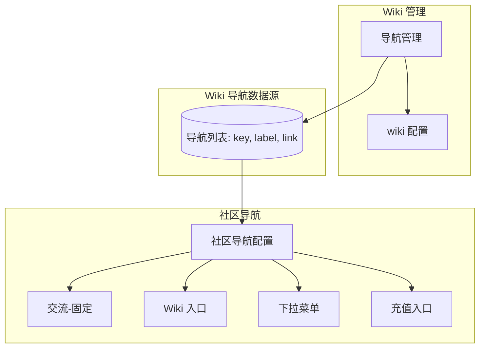
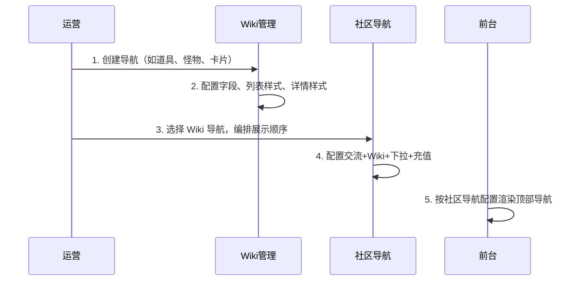
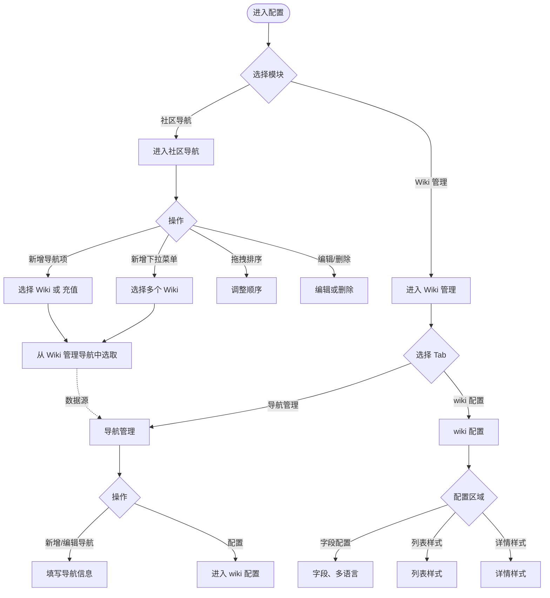

# 社区导航与 Wiki 管理 PRD

# 背景

社区导航与 Wiki 管理是论坛前台 Wiki 内容展示的两个核心配置模块，二者紧密联动：

- **Wiki 管理**：定义 Wiki 的「内容结构」——创建导航项（如道具、怪物、卡片）、配置每个导航的字段、列表样式、详情样式。
- **社区导航**：定义 Wiki 的「前台入口」——在论坛顶部导航中，决定哪些 Wiki 页面以何种形式展示（单个入口、下拉菜单、充值入口等），以及展示顺序。

**数据流向**：Wiki 管理中的导航列表（key、label、link）是社区导航的「数据源」。社区导航在配置时，从 Wiki 管理的导航中选取，组合成前台用户看到的导航结构。因此，必须先有 Wiki 导航，才能在社区导航中引用。

**典型场景**：运营希望在前台顶部展示「交流」「数据库（下拉：宠物、箱子、箭矢制作等）」「卡片」「地图」「充值优惠」。需要在 Wiki 管理中先创建这些导航并配置字段，再在社区导航中按上述结构编排。

# 目标

1. **可配置性**：运营可自主配置前台 Wiki 导航的展示形式与顺序，无需开发介入。
2. **一致性**：社区导航引用的 Wiki 项与 Wiki 管理中的导航保持一一对应，避免孤岛数据。
3. **易用性**：两个模块的配置流程清晰，联动关系明确，降低配置错误率。

# 模块关系图



# 需求

## 一、社区导航

### 1.1 入口与位置

- **入口**：侧边栏「论坛管理」→「社区导航」
- **位置**：对应前台论坛顶部导航的配置，位于「金刚位」与「公告」之间的导航区域

### 1.2 页面结构

1. **面包屑**：论坛管理 / 社区导航
2. **标题**：社区导航配置
3. **操作区**：
   - 「新增下拉菜单」按钮
   - 「新增导航项」按钮（Wiki 导航 或 充值入口）

### 1.3 导航类型与规则

| 类型 | 说明 | 可编辑 | 可删除 | 可拖拽 | 固定位置 |
|------|------|--------|--------|--------|----------|
| 交流 | 论坛默认入口 | 否 | 否 | 否 | 固定第一位 |
| Wiki 导航 | 单个 Wiki 页面入口 | 是 | 是 | 是 | 否 |
| 下拉菜单 | 多个 Wiki 收进一个下拉 | 是 | 是 | 是 | 否 |
| 充值入口 | 可配置跳转链接的入口 | 是 | 是 | 是 | 否 |

### 1.4 导航列表表格

| 列 | 说明 |
|----|------|
| 拖拽 | 拖拽手柄（交流无），用于调整顺序 |
| 导航名称 | 显示名称；交流显示「默认」标签；下拉菜单显示「N 个子项」 |
| 链接 | 交流：灰色标签样式；Wiki/充值：蓝色可点击样式（仅展示，不跳转）；下拉菜单：竖向列出所有子项链接 |
| 状态 | 启用/禁用开关（交流无开关） |
| 操作 | 编辑、删除（交流无） |

### 1.5 新增/编辑导航项（Wiki 或 充值）

**导航类型**：Wiki 导航 / 充值入口

**Wiki 导航**：
- 选择 Wiki 导航：必填，从 Wiki 管理的导航列表中选取
- 显示名称：选填，不填则使用所选 Wiki 的名称

**充值入口**：
- 显示名称：必填
- 跳转链接：必填（如 `/recharge`）

**通用**：启用状态开关

### 1.6 新增/编辑下拉菜单

- 下拉菜单名称：必填（如「数据库」）
- 选择 Wiki 导航：必填，多选，从 Wiki 管理的导航列表中选取
- 启用状态开关

### 1.7 数据联动

- 「选择 Wiki 导航」的选项列表，与 Wiki 管理中的导航管理保持一致（key、label、link）
- 链接自动生成：Wiki 导航为 `/wiki/[key]`，交流为 `/forum/list`，充值入口为用户配置的 link

---

## 二、Wiki 管理

### 2.1 入口与位置

- **入口**：侧边栏「Wiki 管理」
- **路径**：`/wiki`

### 2.2 主 Tab 切换

| Tab | 说明 |
|-----|------|
| 导航管理 | 管理 Wiki 导航项（道具、怪物、卡片等） |
| wiki 配置 | 配置选中导航的字段、列表样式、详情样式 |

### 2.3 导航管理

**页面说明**：管理前台 Wiki 的导航项，每个导航对应一个独立的 Wiki 页面（如道具、怪物、卡片等）

**统计卡片**：总导航数、已启用、未启用

**提示**：点击「配置」进入该导航的字段与数据管理。

**导航列表表格**：

| 列 | 说明 |
|----|------|
| 导航名称 | 主文本 + `key: [key]` |
| 说明 | 导航描述 |
| 链接 | 蓝色可点击样式（如 `/wiki/items`），仅展示 |
| 字段数 | 该导航配置的字段数量 |
| 操作 | 配置、编辑、删除 |

**配置按钮**：点击进入 wiki 配置 Tab，并选中该导航。NPC 和地图可跳转独立页面。

**新增/编辑导航弹窗**：
- 导航 Key：必填，英文标识，编辑时禁用
- 导航名称：必填
- 导航说明：选填
- 前台启用：开关，默认开启

**链接规则**：新建时自动生成 `/wiki/[key]`

### 2.4 wiki 配置（原列表管理）

**当前导航**：下拉选择要配置的导航

**字段配置**：
- 字段列表：字段 Key、显示名称（含多语言）、类型、操作（编辑、删除）
- 新增/编辑字段弹窗：字段 Key、显示名称、字段类型、必填
- 多语言配置：支持手动输入与 AI 翻译

**列表样式**：选择样式（横向卡片、大图宫格、富媒体表格、图片卡片），勾选展示字段，实时预览

**详情样式**：选择详情样式 1 或 2，配置主区域、富媒体表格区域、侧边栏字段，实时预览

---

## 三、联动流程



**配置顺序建议**：
1. 先在 Wiki 管理 → 导航管理中创建所需导航
2. 在 wiki 配置中为各导航配置字段与样式
3. 在社区导航中引用这些导航，编排前台展示

**引用约束**：
- 社区导航中引用的 `wikiKey` 必须存在于 Wiki 管理的导航列表中
- 若 Wiki 管理删除某导航，社区导航中引用该导航的项需同步处理（前端可置灰或提示）

---

## 四、用户使用流程



---

## 五、数据模型

### 5.1 Wiki 导航（Wiki 管理）

```ts
interface WikiNav {
  key: string        // 唯一标识，如 items、monsters
  label: string      // 显示名称
  description: string // 说明
  link: string       // 链接，如 /wiki/items
  enabled: boolean
  fieldCount: number
  order: number
}
```

### 5.2 社区导航条目

```ts
type CommunityNavEntry =
  | { kind: 'discussion'; id: string }
  | { kind: 'wiki'; id: string; wikiKey: string; displayName: string; enabled: boolean }
  | { kind: 'dropdown'; id: string; title: string; wikiKeys: string[]; enabled: boolean }
  | { kind: 'recharge'; id: string; title: string; link: string; enabled: boolean }
```

- `wikiKey` / `wikiKeys` 对应 Wiki 管理中 `WikiNav.key`
- 交流固定 `id: 'discussion'`，链接固定 `/forum/list`

---

## 六、权限

| 角色 | 社区导航 | Wiki 管理 |
|------|----------|-----------|
| [用户填写] | 查看、新增、编辑、删除、拖拽排序 | - |
| [用户填写] | - | 导航管理、wiki 配置全部操作 |

---

## 七、后续扩展

1. **后端持久化**：当前为前端 mock，需接入 API 持久化社区导航与 Wiki 配置
2. **多游戏/多论坛**：社区导航与 Wiki 管理按游戏/论坛维度隔离
3. **引用校验**：删除 Wiki 导航时，校验社区导航中的引用并提示
